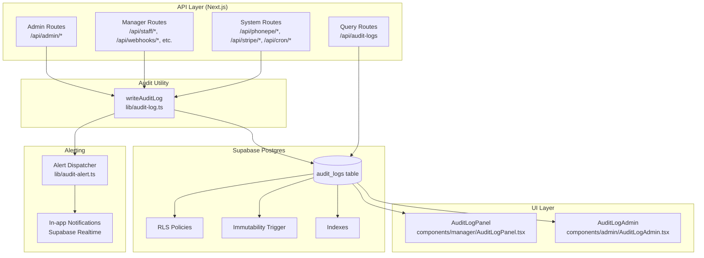

# Design Document: Audit Log

## Overview

The Audit Log feature adds a tamper-evident, queryable record of every significant action across the qr-order platform. It covers all actor types — super admin, restaurant managers, staff (waiters, kitchen), and automated system processes (webhooks, payment callbacks, cron jobs).

The design follows the existing project conventions: Next.js App Router API routes, Supabase Postgres with RLS, service-role writes for privileged operations, and React client components for the UI. Audit entries are written synchronously within each request lifecycle but are non-blocking on failure — a failed write never rolls back the originating action.

### Key Design Decisions

- **Append-only at the database level**: A Postgres trigger blocks any `UPDATE` or `DELETE` on `audit_logs` outside the scheduled purge function, making the log tamper-evident without relying solely on application-layer discipline.
- **Synchronous writes, non-blocking failures**: `writeAuditLog` is `await`-ed inside each route handler so a failed action does not produce a misleading log entry. If the write itself fails, the error is logged server-side and the originating action proceeds.
- **Service-role writes only**: All inserts use the Supabase service-role client so RLS cannot accidentally block a log write. Reads use the anon/user client so RLS enforces restaurant scoping automatically.
- **Cursor-based pagination**: The viewer uses keyset pagination on `(created_at DESC, id DESC)` to maintain consistent performance as the table grows, avoiding `OFFSET` degradation.
- **Severity-driven retention**: The purge cron deletes entries based on their `severity` column, keeping critical entries for 365 days, warning for 90 days, and info for 30 days.

---

## Architecture



### Data Flow for a Typical Action

1. An API route (e.g., `POST /api/staff/create`) performs its primary operation.
2. Before returning the response, it calls `await writeAuditLog(entry)` — wrapped in a try/catch so failure is non-blocking.
3. `writeAuditLog` inserts into `audit_logs` using the service-role client.
4. If `severity === 'critical'`, `writeAuditLog` also calls `dispatchCriticalAlert(entry)` asynchronously (fire-and-forget).
5. The API route returns its normal response.

---

## Components and Interfaces

### `lib/audit-log.ts` — Core Utility

The single entry point for all audit writes. All API routes import and call this function.

```typescript
export type ActorType = 'admin' | 'manager' | 'staff' | 'system' | 'customer';
export type Severity  = 'info' | 'warning' | 'critical';

export interface AuditEntry {
  restaurant_id?:  string | null;
  actor_type:      ActorType;
  actor_id:        string;
  actor_name:      string;
  action:          string;           // e.g. 'staff.created'
  resource_type:   string;           // e.g. 'staff_member'
  resource_id?:    string | null;
  resource_name?:  string | null;
  metadata?:       Record<string, unknown>;
  ip_address?:     string | null;
  // severity is derived automatically from action — callers do not set it
}

/**
 * Write a single audit entry. Uses the service-role client.
 * Never throws — errors are logged server-side only.
 * Returns the inserted row id on success, null on failure.
 */
export async function writeAuditLog(entry: AuditEntry): Promise<string | null>

/**
 * Derive severity from action string.
 * Pure function — no side effects.
 */
export function getSeverity(action: string): Severity

/**
 * Extract the client IP from a Next.js request.
 * Checks X-Forwarded-For, then X-Real-IP, then falls back to null.
 */
export function getClientIp(req: NextRequest): string | null
```

### `lib/audit-alert.ts` — Alert Dispatcher

Handles in-app and webhook notifications for critical events.

```typescript
/**
 * Dispatch a critical alert for the given audit entry.
 * Fire-and-forget — called from writeAuditLog after a critical insert.
 * Retries up to 3 times with 10-second intervals on failure.
 * Deduplicates by audit entry id to prevent duplicate alerts.
 */
export async function dispatchCriticalAlert(
  entryId: string,
  entry: AuditEntry & { severity: 'critical' }
): Promise<void>
```

### API Routes

| Route | Method | Purpose |
|---|---|---|
| `/api/audit-logs` | `GET` | Query/filter audit entries (manager or admin) |
| `/api/audit-logs/export` | `GET` | Export filtered entries as CSV or JSON |
| `/api/cron/audit-log-purge` | `GET` | Scheduled purge of expired entries |

#### `GET /api/audit-logs`

Query parameters:

| Param | Type | Description |
|---|---|---|
| `from` | ISO date string | Start of date range |
| `to` | ISO date string | End of date range |
| `actor_type` | string | Filter by actor type |
| `actor_id` | string | Filter by actor ID |
| `action` | string | Filter by action |
| `resource_type` | string | Filter by resource type |
| `resource_id` | string | Filter by resource ID |
| `severity` | string | Filter by severity |
| `q` | string | Free-text search |
| `page_size` | 25 \| 50 \| 100 | Entries per page (default 25) |
| `cursor` | string | Keyset cursor for next page (format: `{created_at}_{id}`) |
| `restaurant_id` | string | Admin only: scope to a specific restaurant |

Response:

```json
{
  "entries": [...],
  "total_count": 1234,
  "next_cursor": "2024-01-15T10:30:00Z_uuid",
  "has_more": true
}
```

#### `GET /api/audit-logs/export`

Same query parameters as above, plus:

| Param | Type | Description |
|---|---|---|
| `format` | `csv` \| `json` | Export format (JSON only for admin) |

Caps at 10,000 entries. Returns a file download response.

### UI Components

#### `components/manager/AuditLogPanel.tsx`

Used in the Manager Dashboard under the "Account" nav group.

Props:
```typescript
interface AuditLogPanelProps {
  restaurantId: string;
}
```

Features:
- Summary banner: count of `critical` and `warning` entries in the last 24 hours
- Date range selector (today / yesterday / last 7 days / last 30 days / custom)
- Filter bar: severity, actor_type, action, resource_type, free-text search
- Paginated table (25 entries default) with expandable rows showing full metadata
- CSV export button
- Real-time updates via Supabase Realtime channel on `audit_logs`

#### `components/admin/AuditLogAdmin.tsx`

Used in the Admin Panel as a new "Audit Log" tab alongside Restaurants, Coupons, Plans.

Props:
```typescript
interface AuditLogAdminProps {
  pin: string;  // admin PIN, passed through adminFetch proxy
}
```

Features:
- All features of `AuditLogPanel` plus:
  - `restaurant_name` column in the table
  - Restaurant filter dropdown to scope to a single restaurant
  - JSON export option (admin only)
  - Default view: most recent 50 entries across all restaurants

---

## Data Models

### `audit_logs` Table

```sql
CREATE TABLE audit_logs (
  id             UUID        PRIMARY KEY DEFAULT gen_random_uuid(),
  restaurant_id  UUID        REFERENCES restaurants(id) ON DELETE SET NULL,
  actor_type     TEXT        NOT NULL CHECK (actor_type IN ('admin','manager','staff','system','customer')),
  actor_id       TEXT        NOT NULL,
  actor_name     TEXT        NOT NULL,
  action         TEXT        NOT NULL,
  resource_type  TEXT        NOT NULL,
  resource_id    TEXT,
  resource_name  TEXT,
  metadata       JSONB       NOT NULL DEFAULT '{}',
  severity       TEXT        NOT NULL CHECK (severity IN ('info','warning','critical')),
  ip_address     TEXT,
  created_at     TIMESTAMPTZ NOT NULL DEFAULT now()
);
```

**Notes:**
- `id` and `created_at` are always set by the database — the application never supplies them.
- `restaurant_id` is nullable for platform-level admin actions.
- `metadata` stores before/after snapshots, changed fields, and any action-specific context.

### Indexes

```sql
-- Primary query pattern: restaurant + time range
CREATE INDEX idx_audit_logs_restaurant_time
  ON audit_logs (restaurant_id, created_at DESC);

-- Severity-filtered queries (e.g. "show only critical entries")
CREATE INDEX idx_audit_logs_restaurant_severity_time
  ON audit_logs (restaurant_id, severity, created_at DESC);

-- Resource-scoped lookups (e.g. "all actions on order X")
CREATE INDEX idx_audit_logs_resource
  ON audit_logs (resource_type, resource_id);

-- Keyset pagination cursor
CREATE INDEX idx_audit_logs_cursor
  ON audit_logs (created_at DESC, id DESC);

-- Platform-wide admin queries (null restaurant_id)
CREATE INDEX idx_audit_logs_time
  ON audit_logs (created_at DESC);
```

### RLS Policies

```sql
-- Enable RLS
ALTER TABLE audit_logs ENABLE ROW LEVEL SECURITY;

-- Managers can only read their own restaurant's entries
CREATE POLICY "manager_read_own_restaurant"
  ON audit_logs FOR SELECT
  USING (
    restaurant_id = (
      SELECT restaurant_id FROM users
      WHERE auth_id = auth.uid() AND role = 'manager'
    )
  );

-- No INSERT/UPDATE/DELETE via RLS for regular users
-- All writes go through the service-role client in writeAuditLog
-- The immutability trigger provides the second layer of protection
```

### Immutability Trigger

```sql
CREATE OR REPLACE FUNCTION audit_logs_immutable()
RETURNS TRIGGER LANGUAGE plpgsql AS $$
BEGIN
  -- Allow DELETE only from the purge function (identified by a session variable)
  IF TG_OP = 'DELETE' THEN
    IF current_setting('app.audit_purge_active', true) = 'true' THEN
      RETURN OLD;
    END IF;
    RAISE EXCEPTION 'audit_logs rows are immutable — direct DELETE is not permitted';
  END IF;
  -- Block all UPDATEs unconditionally
  IF TG_OP = 'UPDATE' THEN
    RAISE EXCEPTION 'audit_logs rows are immutable — UPDATE is not permitted';
  END IF;
  RETURN NULL;
END;
$$;

CREATE TRIGGER audit_logs_immutability_guard
  BEFORE UPDATE OR DELETE ON audit_logs
  FOR EACH ROW EXECUTE FUNCTION audit_logs_immutable();
```

The purge cron sets `SET LOCAL app.audit_purge_active = 'true'` within its transaction before deleting expired rows, which is the only permitted deletion path.

### Severity Mapping

```typescript
const CRITICAL_ACTIONS = new Set([
  'restaurant.activated', 'restaurant.deactivated',
  'auth.password_changed',
  'staff.deleted',
  'coupon.created', 'coupon.deleted',
  'billing.plan_changed',
  'webhook.secret_rotated',
]);

const WARNING_ACTIONS = new Set([
  'staff.created', 'staff.deactivated',
  'webhook.created', 'webhook.deleted',
  'billing.subscription_activated', 'billing.subscription_expired',
  'order.cancelled',
]);

// All other tracked actions → 'info'
```

### Retention Periods

| Severity | Retention |
|---|---|
| `critical` | 365 days |
| `warning` | 90 days |
| `info` | 30 days |

### `audit_notifications` Table

Tracks in-app notification dispatch for critical events to prevent duplicates.

```sql
CREATE TABLE audit_notifications (
  id           UUID        PRIMARY KEY DEFAULT gen_random_uuid(),
  audit_log_id UUID        NOT NULL REFERENCES audit_logs(id),
  restaurant_id UUID       NOT NULL,
  status       TEXT        NOT NULL CHECK (status IN ('pending','delivered','failed')),
  attempts     INT         NOT NULL DEFAULT 0,
  last_error   TEXT,
  created_at   TIMESTAMPTZ NOT NULL DEFAULT now(),
  delivered_at TIMESTAMPTZ,
  UNIQUE (audit_log_id)  -- prevents duplicate notifications per entry
);
```

---

## Correctness Properties

*A property is a characteristic or behavior that should hold true across all valid executions of a system — essentially, a formal statement about what the system should do. Properties serve as the bridge between human-readable specifications and machine-verifiable correctness guarantees.*

### Property 1: Audit Entry Field Completeness

*For any* valid action input (actor type, actor id, actor name, action string, resource type), calling `writeAuditLog` should produce an entry where all required fields (`id`, `actor_type`, `actor_id`, `actor_name`, `action`, `resource_type`, `severity`, `created_at`) are non-null and non-empty.

**Validates: Requirements 1.1, 8.3, 8.4**

### Property 2: Severity Assignment Correctness

*For any* action string in the full set of tracked actions, `getSeverity(action)` should return exactly one of `'info'`, `'warning'`, or `'critical'`, and the result should be consistent with the severity mapping table — critical actions always return `'critical'`, warning actions always return `'warning'`, and all other tracked actions return `'info'`.

**Validates: Requirements 1.4, 1.5, 1.6**

### Property 3: Manager Access Scoping

*For any* manager user with a given `restaurant_id`, querying the audit log API should return only entries where `entry.restaurant_id === manager.restaurant_id`. No entry from a different restaurant should ever appear in the result set.

**Validates: Requirements 3.1, 3.4**

### Property 4: Staff Access Denial

*For any* staff user (role `waiter` or `kitchen`), any request to the audit log query or export endpoints should be rejected with a 401 or 403 status code.

**Validates: Requirements 3.3**

### Property 5: Filter AND Logic

*For any* combination of active filter parameters (date range, actor_type, action, severity, resource_type) and any set of audit entries, every entry returned by the query should satisfy all active filters simultaneously. No entry that fails any single filter condition should appear in the results.

**Validates: Requirements 4.1, 4.3**

### Property 6: Result Ordering

*For any* query result set containing two or more entries, the entries should be ordered such that `entries[i].created_at >= entries[i+1].created_at` for all valid indices `i`. When `created_at` values are equal, entries should be ordered by `id DESC`.

**Validates: Requirements 4.4**

### Property 7: Pagination Completeness and Non-Overlap

*For any* query with a given filter set and page size `n`, iterating through all pages using cursor-based pagination should yield every matching entry exactly once — no entry should appear on two different pages, and no matching entry should be omitted.

**Validates: Requirements 4.5, 9.5**

### Property 8: Total Count Accuracy

*For any* filter combination, the `total_count` field in the response should equal the actual number of entries in the database that satisfy those filters, regardless of the current page or cursor position.

**Validates: Requirements 4.7**

### Property 9: Retention Purge Correctness

*For any* set of audit entries with known `severity` values and `created_at` timestamps, running the purge process should delete exactly those entries whose age (in days) exceeds the retention period for their severity (`critical` > 365, `warning` > 90, `info` > 30), and should leave all other entries untouched.

**Validates: Requirements 5.1, 5.2, 5.3, 5.4**

### Property 10: CSV Export Column Completeness

*For any* set of audit entries passed to the CSV export function, the resulting CSV should contain all required columns (`id`, `created_at`, `actor_type`, `actor_name`, `action`, `resource_type`, `resource_name`, `severity`, `ip_address`) and each row should contain the correct values from the corresponding entry.

**Validates: Requirements 6.1, 6.5**

### Property 11: Export Self-Logging

*For any* export operation (CSV or JSON), an `audit_log.exported` entry should be created in the audit log containing the applied filter parameters and the count of exported entries. This property holds regardless of the filter combination or export format.

**Validates: Requirements 6.4**

### Property 12: Alert Content Completeness

*For any* critical audit entry, the alert payload generated by `dispatchCriticalAlert` should contain all required fields: `action`, `actor_name`, `actor_type`, `resource_type`, `resource_name` (if present), and `created_at` timestamp.

**Validates: Requirements 7.3**

### Property 13: Alert Idempotency

*For any* audit entry ID, calling the alert dispatch function multiple times with the same entry ID should result in at most one delivered notification. Duplicate dispatch attempts should be detected via the `audit_notifications` unique constraint and silently skipped.

**Validates: Requirements 7.5**

### Property 14: UUID Validity

*For any* audit entry created via `writeAuditLog`, the `id` field should be a valid UUID v4 string matching the pattern `^[0-9a-f]{8}-[0-9a-f]{4}-4[0-9a-f]{3}-[89ab][0-9a-f]{3}-[0-9a-f]{12}$`.

**Validates: Requirements 8.3**

---

## Error Handling

### Write Failures

`writeAuditLog` wraps the Supabase insert in a try/catch. On failure:
1. The error is logged to the server console with the full entry payload: `console.error('[audit-log] write failed', { error, entry })`.
2. The function returns `null`.
3. The calling route proceeds normally — the originating action is not rolled back.

This satisfies Requirement 1.3: a failed audit write must never block the primary operation.

### Query Failures

The `/api/audit-logs` route returns a structured error response:
```json
{ "error": "Failed to query audit logs", "code": "QUERY_ERROR" }
```
with HTTP 500. The UI shows a generic error state with a retry button.

### Export Failures

If the export query fails mid-stream, the route returns HTTP 500 with a JSON error body. The UI shows an error toast. No partial file is delivered.

### Alert Dispatch Failures

`dispatchCriticalAlert` retries up to 3 times with 10-second intervals using exponential backoff. After 3 failures, the `audit_notifications` row is marked `status = 'failed'` and the error is logged. The audit entry itself is unaffected.

### Purge Failures

The purge cron logs any errors and returns HTTP 500. The next scheduled run will re-attempt. Because the purge uses `SET LOCAL app.audit_purge_active = 'true'` within a transaction, a partial failure rolls back the entire purge batch, leaving no orphaned state.

### Access Control Violations

When a manager attempts to query outside their restaurant scope (e.g., by passing a different `restaurant_id`), the RLS policy returns an empty result set. The API route additionally logs a `warning` audit entry with action `audit_log.unauthorized_access_attempt`.

---

## Testing Strategy

### Unit Tests (Example-Based)

Located in `qr-order/lib/__tests__/audit-log.test.ts`.

- `getSeverity` returns correct values for all action strings in each severity bucket
- `getClientIp` extracts IP from `X-Forwarded-For`, `X-Real-IP`, and falls back to null
- `writeAuditLog` with a mocked Supabase client: verifies the insert payload shape
- `writeAuditLog` when the DB insert fails: verifies the function returns null and does not throw
- CSV export formatter: verifies column order and value escaping for entries with special characters
- Cursor encoding/decoding: verifies round-trip of `(created_at, id)` → cursor string → `(created_at, id)`

### Property-Based Tests

Located in `qr-order/lib/__tests__/audit-log.property.test.ts`.

Uses **fast-check** (already a common choice in TypeScript/Next.js projects) with a minimum of 100 iterations per property.

Each test is tagged with a comment referencing the design property:
```typescript
// Feature: audit-log, Property 2: Severity Assignment Correctness
```

Properties to implement:

| Property | Generator | Assertion |
|---|---|---|
| P1: Field Completeness | Random `AuditEntry` inputs | All required fields non-null after insert |
| P2: Severity Assignment | Random action strings from the tracked action set | `getSeverity(action)` matches expected bucket |
| P3: Manager Scoping | Random manager + multi-restaurant entry set | Query returns only own-restaurant entries |
| P4: Staff Access Denial | Random staff user (waiter/kitchen) | API returns 401/403 |
| P5: Filter AND Logic | Random filter combos + random entry sets | All results satisfy all active filters |
| P6: Result Ordering | Random entry sets | Results are sorted `created_at DESC, id DESC` |
| P7: Pagination Completeness | Random page sizes + entry counts | All entries appear exactly once across pages |
| P8: Total Count Accuracy | Random filter combos | `total_count` matches actual matching count |
| P9: Retention Purge | Random entries with varied ages/severities | Purge deletes exactly the expired entries |
| P10: CSV Column Completeness | Random entry sets | CSV contains all required columns with correct values |
| P11: Export Self-Logging | Random export operations | `audit_log.exported` entry created with correct metadata |
| P12: Alert Content | Random critical entries | Alert payload contains all required fields |
| P13: Alert Idempotency | Random entry IDs, multiple dispatch calls | At most one notification delivered per entry ID |
| P14: UUID Validity | Random entry creation calls | `id` matches UUID v4 regex |

### Integration Tests

- Supabase RLS: verify manager cannot read another restaurant's entries via direct DB query
- Immutability trigger: attempt `UPDATE` and `DELETE` on `audit_logs`, verify exception is raised
- Purge cron: run against a test database with known data, verify correct rows deleted
- Alert dispatch: mock Supabase Realtime, verify notification is inserted for critical entries

### Smoke Tests

- Verify `audit_logs` table exists with correct schema
- Verify all 5 indexes exist
- Verify RLS is enabled on `audit_logs`
- Verify immutability trigger exists
- Verify cron route is registered in `vercel.json`
