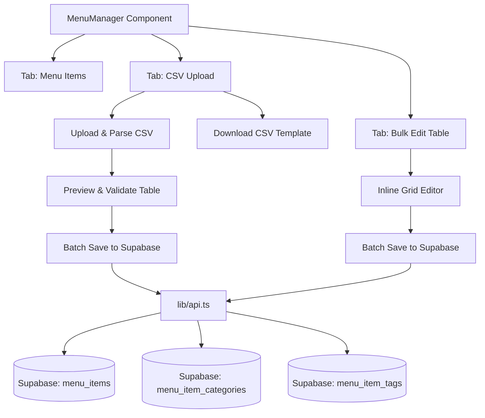
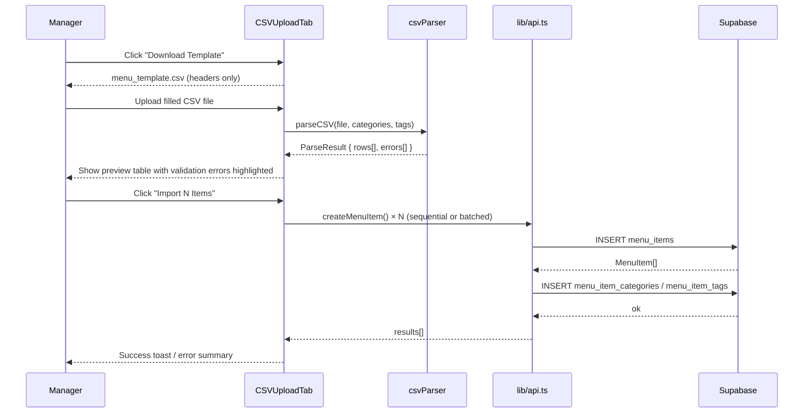
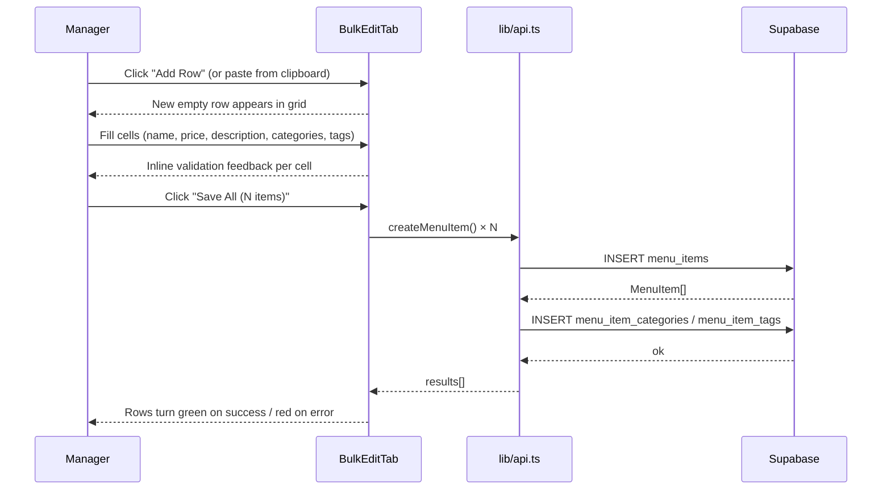

# Design Document: Bulk Menu Upload

## Overview

The Bulk Menu Upload feature extends the existing `MenuManager` component with two complementary workflows for adding multiple menu items at once: a **CSV upload** flow (download template → fill in spreadsheet → upload) and an **inline editable table** (spreadsheet-like grid directly in the browser). Both modes live inside `MenuManager` as additional tabs alongside the existing single-item dialog, and both respect the existing subscription plan limits.

The feature integrates with the existing `createMenuItem`, `setMenuItemCategories`, and `setMenuItemTags` API functions, and reuses the existing `FoodCategory` and `FoodTag` data already loaded by `MenuManager`.

---

## Architecture



---

## Sequence Diagrams

### CSV Upload Flow



### Inline Bulk Edit Flow



---

## Components and Interfaces

### Component: `BulkMenuUpload` (container)

**Purpose**: Renders the two new tabs inside `MenuManager` and owns shared state (categories, tags, plan limits).

**Interface**:
```typescript
interface BulkMenuUploadProps {
  restaurantId: string;
  categories: FoodCategory[];
  tags: FoodTag[];
  isPro: boolean;
  currentItemCount: number;
  maxItems: number;
  onImportComplete: () => void; // triggers MenuManager to reload items
}
```

**Responsibilities**:
- Renders `<Tabs>` with "CSV Upload" and "Bulk Edit" panels
- Passes shared data (categories, tags, limits) down to child tabs
- Calls `onImportComplete` after a successful batch save

---

### Component: `CSVUploadTab`

**Purpose**: Handles the download-template → upload → preview → import workflow.

**Interface**:
```typescript
interface CSVUploadTabProps {
  restaurantId: string;
  categories: FoodCategory[];
  tags: FoodTag[];
  remainingSlots: number; // maxItems - currentItemCount
  onImportComplete: () => void;
}
```

**Responsibilities**:
- Generates and triggers download of `menu_template.csv`
- Accepts file input (`.csv` only)
- Calls `parseCSV()` and renders the preview table
- Shows per-row validation errors inline
- Calls `batchCreateMenuItems()` on confirm
- Shows progress indicator and final success/error summary

---

### Component: `BulkEditTab`

**Purpose**: Spreadsheet-like grid where managers type rows directly.

**Interface**:
```typescript
interface BulkEditTabProps {
  restaurantId: string;
  categories: FoodCategory[];
  tags: FoodTag[];
  remainingSlots: number;
  onImportComplete: () => void;
}
```

**Responsibilities**:
- Maintains a local array of `DraftRow[]` in state
- Renders an editable table with one row per draft item
- Provides "Add Row" button and per-row delete
- Validates each row on blur/change
- Calls `batchCreateMenuItems()` on "Save All"
- Shows per-row success/error state after save

---

### Utility: `csvParser.ts`

**Purpose**: Pure functions for CSV template generation and parsing.

**Interface**:
```typescript
// CSV column headers (order matters for template)
const CSV_COLUMNS = ['name', 'price', 'description', 'categories', 'tags', 'is_available'] as const;

function generateCSVTemplate(categories: FoodCategory[], tags: FoodTag[]): string
// Returns CSV string with header row + comment row showing available category/tag names

function parseCSV(
  csvText: string,
  categories: FoodCategory[],
  tags: FoodTag[]
): ParseResult

interface ParseResult {
  rows: DraftRow[];
  errors: ParseError[];
}

interface ParseError {
  rowIndex: number;
  field: string;
  message: string;
}
```

---

### Utility: `batchCreateMenuItems.ts`

**Purpose**: Orchestrates sequential creation of multiple menu items with categories and tags.

**Interface**:
```typescript
interface BatchCreateParams {
  restaurantId: string;
  rows: DraftRow[];
  categories: FoodCategory[];
  tags: FoodTag[];
}

interface BatchCreateResult {
  succeeded: number;
  failed: number;
  errors: Array<{ rowIndex: number; message: string }>;
}

async function batchCreateMenuItems(params: BatchCreateParams): Promise<BatchCreateResult>
```

---

## Data Models

### `DraftRow` — shared between CSV and inline editor

```typescript
interface DraftRow {
  // User-editable fields
  name: string;
  price: string;           // kept as string for input binding; parsed to number on save
  description: string;
  categoryNames: string[]; // display names, resolved to IDs on save
  tagNames: string[];      // display names, resolved to IDs on save
  is_available: boolean;

  // UI state
  _id: string;             // client-side key (crypto.randomUUID())
  _errors: Record<string, string>; // field → error message
  _status: 'idle' | 'saving' | 'saved' | 'error';
}
```

### CSV Template Format

```
name,price,description,categories,tags,is_available
# Available categories: Starters | Mains | Desserts | Drinks
# Available tags: Veg | Non-Veg | Spicy | Gluten-Free
Margherita Pizza,299,Classic tomato and mozzarella,Mains,Veg,true
```

- `categories` and `tags` columns accept pipe-separated (`|`) names matching existing category/tag names (case-insensitive)
- `is_available` accepts `true`/`false`/`1`/`0`/`yes`/`no` (defaults to `true` if blank)
- `price` must be a positive number

---

## Key Functions with Formal Specifications

### `parseCSV(csvText, categories, tags)`

```typescript
function parseCSV(csvText: string, categories: FoodCategory[], tags: FoodTag[]): ParseResult
```

**Preconditions:**
- `csvText` is a non-empty string
- `categories` and `tags` are valid arrays (may be empty)

**Postconditions:**
- Returns `ParseResult` with `rows` and `errors` arrays
- Every row in `rows` has a unique `_id`
- Rows with missing required fields (`name`, `price`) have corresponding entries in `errors`
- `price` in each row is a valid positive number string or the row has a price error
- Category/tag names not found in the provided lists produce warnings (not blocking errors) — unknown names are silently dropped
- Header row and comment rows (starting with `#`) are skipped

**Loop Invariants:**
- For each processed line: all previously validated rows remain in `rows`; all previously found errors remain in `errors`

---

### `batchCreateMenuItems(params)`

```typescript
async function batchCreateMenuItems(params: BatchCreateParams): Promise<BatchCreateResult>
```

**Preconditions:**
- `params.rows` is non-empty
- All rows in `params.rows` have passed client-side validation (`_errors` is empty)
- `params.restaurantId` is a valid UUID

**Postconditions:**
- For each row: `createMenuItem()` is called exactly once
- For each successfully created item: `setMenuItemCategories()` and `setMenuItemTags()` are called
- `result.succeeded + result.failed === params.rows.length`
- Failure of one row does not abort processing of subsequent rows
- `result.errors` contains one entry per failed row with a descriptive message

**Loop Invariants:**
- `succeeded + failed === number of rows processed so far`
- All previously processed rows have their final status (saved or error)

---

### `generateCSVTemplate(categories, tags)`

```typescript
function generateCSVTemplate(categories: FoodCategory[], tags: FoodTag[]): string
```

**Preconditions:**
- `categories` and `tags` are valid arrays (may be empty)

**Postconditions:**
- Returns a valid CSV string
- First line is the header row with exactly the columns defined in `CSV_COLUMNS`
- If categories are non-empty, a comment line listing available category names is included
- If tags are non-empty, a comment line listing available tag names is included
- The returned string is valid UTF-8 and safe to encode as a Blob for download

---

## Algorithmic Pseudocode

### CSV Parse Algorithm

```pascal
ALGORITHM parseCSV(csvText, categories, tags)
INPUT: csvText: string, categories: FoodCategory[], tags: FoodTag[]
OUTPUT: ParseResult { rows: DraftRow[], errors: ParseError[] }

BEGIN
  rows ← []
  errors ← []
  lines ← splitLines(csvText)
  headerIndex ← findHeaderLine(lines)  // first non-comment line

  IF headerIndex = -1 THEN
    RETURN { rows: [], errors: [{ rowIndex: 0, field: 'file', message: 'No header row found' }] }
  END IF

  headers ← parseCSVLine(lines[headerIndex])
  categoryMap ← buildNameMap(categories)  // lowercase name → id
  tagMap ← buildNameMap(tags)

  FOR i ← headerIndex + 1 TO lines.length - 1 DO
    line ← lines[i]
    IF line starts with '#' OR line is blank THEN CONTINUE END IF

    cells ← parseCSVLine(line)
    row ← buildDraftRow(headers, cells)

    // Validate required fields
    IF row.name is blank THEN
      errors.push({ rowIndex: i, field: 'name', message: 'Name is required' })
    END IF

    IF row.price is blank OR NOT isPositiveNumber(row.price) THEN
      errors.push({ rowIndex: i, field: 'price', message: 'Price must be a positive number' })
    END IF

    // Resolve category/tag names to IDs (unknown names silently dropped)
    row.categoryNames ← row.categoryNames.filter(n → categoryMap.has(n.toLowerCase()))
    row.tagNames ← row.tagNames.filter(n → tagMap.has(n.toLowerCase()))

    rows.push(row)
  END FOR

  RETURN { rows, errors }
END
```

### Batch Create Algorithm

```pascal
ALGORITHM batchCreateMenuItems(params)
INPUT: params: { restaurantId, rows, categories, tags }
OUTPUT: BatchCreateResult { succeeded, failed, errors }

BEGIN
  succeeded ← 0
  failed ← 0
  errors ← []
  categoryMap ← buildNameToIdMap(params.categories)
  tagMap ← buildNameToIdMap(params.tags)

  FOR i ← 0 TO params.rows.length - 1 DO
    ASSERT succeeded + failed = i  // loop invariant

    row ← params.rows[i]
    TRY
      item ← AWAIT createMenuItem({
        restaurantId: params.restaurantId,
        name: row.name.trim(),
        price: parseFloat(row.price),
        description: row.description.trim() OR null,
        image_url: null,
        tags: null
      })

      IF item = null THEN
        THROW Error("createMenuItem returned null")
      END IF

      categoryIds ← row.categoryNames.map(n → categoryMap[n.toLowerCase()])
      tagIds ← row.tagNames.map(n → tagMap[n.toLowerCase()])

      AWAIT setMenuItemCategories(item.id, categoryIds)
      AWAIT setMenuItemTags(item.id, tagIds)

      succeeded ← succeeded + 1
    CATCH err
      failed ← failed + 1
      errors.push({ rowIndex: i, message: err.message })
    END TRY
  END FOR

  ASSERT succeeded + failed = params.rows.length  // postcondition

  RETURN { succeeded, failed, errors }
END
```

---

## Error Handling

### CSV Parse Errors

**Condition**: Required fields (`name`, `price`) are missing or invalid  
**Response**: Row is included in the preview table with the error cell highlighted in red; the "Import" button is disabled until all errors are resolved or the offending rows are removed  
**Recovery**: Manager edits the CSV and re-uploads, or removes the invalid rows from the preview

### Plan Limit Exceeded

**Condition**: `currentItemCount + validRowCount > maxItems` for free-plan users  
**Response**: Warning banner shown in the preview/grid: "You can only import N more items on the free plan." Import button is disabled if the batch would exceed the limit; manager can delete rows to bring count within limit  
**Recovery**: Manager removes rows or upgrades to Pro

### Partial Batch Failure

**Condition**: One or more `createMenuItem` calls fail during batch save  
**Response**: Successfully created rows are marked green; failed rows are marked red with the error message; a summary toast shows "X of Y items imported successfully"  
**Recovery**: Manager can retry failed rows (re-attempt save on error rows only)

### Invalid CSV File

**Condition**: Uploaded file is not valid CSV (binary file, wrong encoding, no recognisable header)  
**Response**: Error message shown below the file input: "Could not parse file. Please use the downloaded template."  
**Recovery**: Manager downloads the template and tries again

---

## Testing Strategy

### Unit Testing Approach

Test `csvParser.ts` and `batchCreateMenuItems.ts` in isolation:
- `parseCSV` with valid CSV, missing required fields, unknown category/tag names, comment rows, blank lines
- `generateCSVTemplate` output structure and encoding
- `batchCreateMenuItems` with mocked `createMenuItem` returning success, null, and throwing

### Property-Based Testing Approach

**Property Test Library**: `fast-check`

Key properties:
- For any valid `DraftRow[]`, `batchCreateMenuItems` result satisfies `succeeded + failed === rows.length`
- For any CSV string generated by `generateCSVTemplate` and then parsed by `parseCSV`, the result has zero errors (round-trip property)
- For any `DraftRow` with a blank `name`, `parseCSV` produces at least one error for that row

### Integration Testing Approach

- Render `CSVUploadTab` with mock categories/tags, upload a fixture CSV, verify the preview table renders correct row count and error highlights
- Render `BulkEditTab`, add rows, fill fields, click Save, verify `createMenuItem` is called the correct number of times

---

## Performance Considerations

- Batch saves are sequential (one `createMenuItem` call at a time) to avoid Supabase rate limits and to provide per-row progress feedback. For Pro users with large imports (50+ items), a progress bar shows `X / N saved`.
- CSV parsing is synchronous and runs in the render thread; files up to ~1 MB (thousands of rows) parse in under 100 ms. No Web Worker needed for typical restaurant menus.
- The inline grid is virtualised only if row count exceeds 100; for typical use (< 50 rows) a plain `<table>` is sufficient.

---

## Security Considerations

- File type is validated client-side (`.csv` extension + MIME type check) and the raw text is parsed — no file is uploaded to storage.
- All data is inserted via the existing `createMenuItem` API which enforces `restaurant_id` scoping through Supabase RLS policies.
- Price values are parsed with `parseFloat` and validated to be positive finite numbers before insertion.
- Category and tag name resolution is done against the server-fetched lists, preventing injection of arbitrary IDs.

---

## Dependencies

- `papaparse` — robust CSV parsing (handles quoted fields, line endings, encoding). Already a common dependency in Next.js projects; add if not present.
- Existing: `@/lib/api` (`createMenuItem`, `setMenuItemCategories`, `setMenuItemTags`, `getFoodCategories`, `getFoodTags`)
- Existing: `@/components/ui` (Tabs, Table, Button, Input, Badge)
- Existing: `@/hooks/useSubscription` (plan limits)
- Existing: `@/types/database` (`MenuItem`, `FoodCategory`, `FoodTag`, `DraftRow` to be added)
